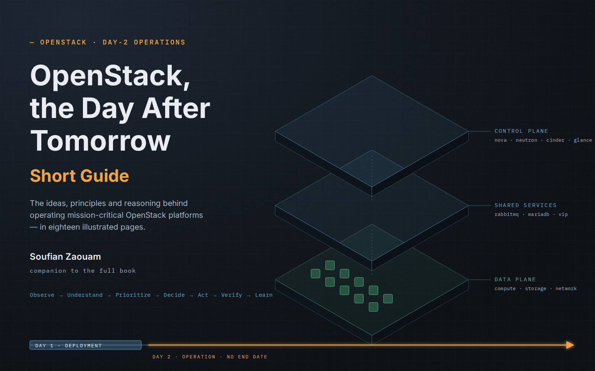

# OpenStack, the Day After Tomorrow — Short Guide



A short, illustrated introduction to the ideas of the book **[OpenStack, the Day After Tomorrow — Operating Mission-Critical OpenStack Platforms](https://github.com/soufian-zaouam/openstack-the-day-after-tomorrow)**.

## What this is

The book is about what happens after OpenStack is deployed: keeping a mission-critical platform understandable, operable, recoverable and able to evolve while its releases, dependencies, workloads and people change.

This guide condenses that thinking into **18 illustrated pages**. It is not a summary chapter by chapter and it is not a command reference. It is organized around the book's central ideas — control, visibility before action, stability before evolution, risk and decision rights, recovery, technical debt, lifecycle, and the organization behind the platform — so that a reader can understand *how the book thinks about operating OpenStack in production* in well under an hour.

## Who it is for

OpenStack engineers and architects, platform and infrastructure leads, technical managers, and anyone discovering this work. No specific distribution, deployment tool or monitoring stack is assumed.

## How to use it

- **Read it in order** in the [`guide/`](guide/) folder, starting with the [cover page](guide/01-cover.md). Each page carries one idea and one figure; navigation links at the bottom of each page lead to the next.
- **Read it as a single document**: [`OpenStack-the-Day-After-Tomorrow-Short-Guide.pdf`](OpenStack-the-Day-After-Tomorrow-Short-Guide.pdf).
- **Short path for managers and sponsors**: pages 02, 03, 09, 15, 16 and 17.
- **Use the figures** in [`images/`](images/) as thinking aids in reviews and discussions; each one is designed to be read on its own.

## Guide and book

The guide gives the ideas; the book develops them. Quotations in the guide are taken verbatim from the book and cite their chapter. The book adds what a short guide cannot carry: the reasoning in full, the technical notes on Nova, Neutron, RabbitMQ, Galera, SLURP and live migration, the control assessment worksheet, the decision framework with its gates and weighted model, and the field cases worked through in detail.

**Full book:** https://github.com/soufian-zaouam/openstack-the-day-after-tomorrow

**In practice:** the [OpenStack Production Guide](https://github.com/soufian-zaouam/openstack-production-guide) gives the checks, commands and anonymised incident cases behind these ideas.

## Contents

| Page | Idea | Figure |
|---|---|---|
| 01 | [OpenStack, the Day After Tomorrow — Short Guide](guide/01-cover.md) | [fig. 01](images/01-cover.png) |
| 02 | [The real challenge starts after deployment](guide/02-the-real-challenge.md) | [fig. 02](images/02-the-real-challenge.png) |
| 03 | [The enemy is loss of control](guide/03-loss-of-control.md) | [fig. 03](images/03-loss-of-control.png) |
| 04 | [The operational mindset: understand before acting](guide/04-the-operating-loop.md) | [fig. 04](images/04-the-operating-loop.png) |
| 05 | [Read the signals before touching the platform](guide/05-read-the-signals.md) | [fig. 05](images/05-read-the-signals.png) |
| 06 | [Investigate before changing](guide/06-investigate-before-changing.md) | [fig. 06](images/06-investigate-before-changing.png) |
| 07 | [Understand the dependencies](guide/07-understand-dependencies.md) | [fig. 07](images/07-understand-dependencies.png) |
| 08 | [Stability before evolution](guide/08-stability-before-evolution.md) | [fig. 08](images/08-stability-before-evolution.png) |
| 09 | [Production is risk management](guide/09-production-is-risk-management.md) | [fig. 09](images/09-production-is-risk-management.png) |
| 10 | [Controlled change](guide/10-controlled-change.md) | [fig. 10](images/10-controlled-change.png) |
| 11 | [Recovery is a feature](guide/11-recovery-is-a-feature.md) | [fig. 11](images/11-recovery-is-a-feature.png) |
| 12 | [Technical debt: understood, controlled, decided](guide/12-technical-debt.md) | [fig. 12](images/12-technical-debt.png) |
| 13 | [Security, upgrades and maintenance](guide/13-security-upgrades-maintenance.md) | [fig. 13](images/13-security-upgrades-maintenance.png) |
| 14 | [Operational memory and ownership](guide/14-operational-memory.md) | [fig. 14](images/14-operational-memory.png) |
| 15 | [A team, not a collection of experts](guide/15-a-team-not-experts.md) | [fig. 15](images/15-a-team-not-experts.png) |
| 16 | [Decisions from the field](guide/16-decisions-from-the-field.md) | [fig. 16](images/16-decisions-from-the-field.png) |
| 17 | [The operating principles](guide/17-operating-principles.md) | [fig. 17](images/17-operating-principles.png) |
| 18 | [From deployment to operation](guide/18-from-deployment-to-operation.md) | [fig. 18](images/18-from-deployment-to-operation.png) |

## Repository layout

```
README.md
OpenStack-the-Day-After-Tomorrow-Short-Guide.pdf
guide/     one Markdown file per page
images/    one figure per page (PNG)
LICENSE
```

## Author and licence

Written by Soufian Zaouam ([LinkedIn](https://www.linkedin.com/in/soufian-zaouam)) as a personal contribution. This is an independent work; it is not affiliated with, sponsored by or endorsed by the OpenInfra Foundation or any OpenStack project team. OpenStack is a trademark of the OpenStack Foundation d/b/a Open Infrastructure Foundation.

Licensed under [Creative Commons Attribution-NonCommercial-NoDerivatives 4.0 International](https://creativecommons.org/licenses/by-nc-nd/4.0/) (CC BY-NC-ND 4.0), like the book. See [LICENSE](LICENSE).
