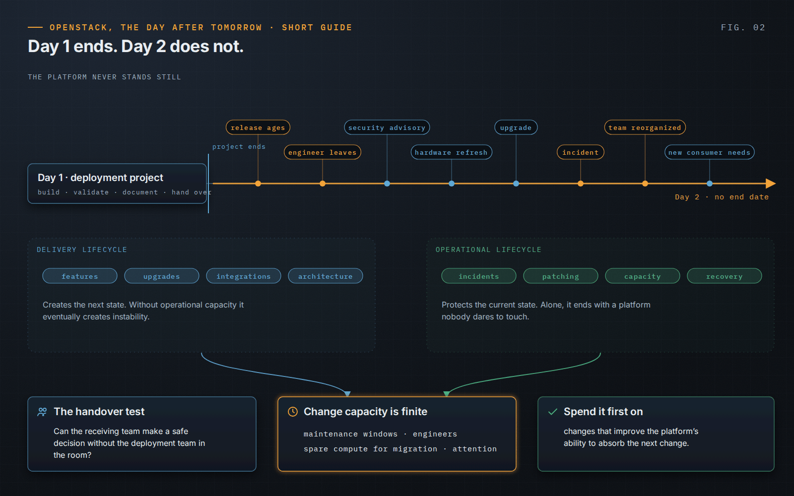

OpenStack, the Day After Tomorrow · Short Guide · page 02 of 18

# 02 · The real challenge starts after deployment

*Day 1 ends. Day 2 does not.*

**A deployment project has an end date. Production does not. The difficult part of OpenStack is not making it work once, but keeping it under control after the people who built it have moved on.**

### Two lifecycles, one platform

The platform lives two intertwined lives. The *delivery lifecycle* brings features, upgrades and integrations; the *operational lifecycle* absorbs incidents, maintenance, patching, capacity and recovery. A team that only delivers eventually creates instability; a team that only protects the current state eventually owns a platform nobody dares to touch. Day 2 needs an explicit balance between the two, decided rather than left to whoever shouts loudest.

### The handover is a capability transfer

A runbook does not transfer the reasons behind a RabbitMQ topology, a constrained Nova setting or a critical network path. The real test of a handover is whether the receiving organization can make a safe decision without the deployment team in the room. When it cannot, the organization has not created an operating model; it has extended the deployment team into production.

### Change capacity is finite

Maintenance windows, engineers, spare compute for live migration and attention are all limited. The book calls this *change capacity* and argues for spending it first on changes that improve the platform’s ability to absorb the next change.

> **Principle.** “The measure of a successful deployment is whether the platform remains operable when the deployment experts are no longer present.”
>
> — *OpenStack, the Day After Tomorrow*, Chapter 1

---

[← 01 · OpenStack, the Day After Tomorrow — Short Guide](01-cover.md) &nbsp;·&nbsp; [Contents](../README.md#contents) &nbsp;·&nbsp; [03 · The enemy is loss of control →](03-loss-of-control.md)
