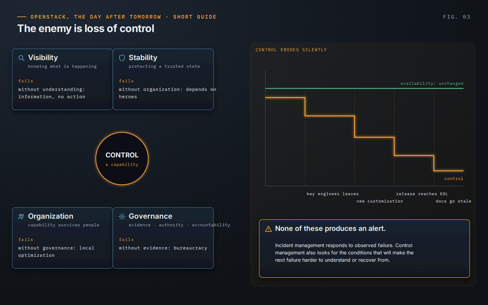

OpenStack, the Day After Tomorrow · Short Guide · page 03 of 18

# 03 · The enemy is loss of control

*Control, not perfection*

**Availability is what the business sees today. Control is what decides whether the organization can still understand, decide, intervene, recover and evolve tomorrow.**

### Four capabilities

The book organizes Day-2 operations around four capabilities. **Visibility**: knowing what is happening. **Stability**: protecting what matters and keeping a trusted operating state. **Organization**: making knowledge and capability survive people. **Governance**: making decisions with the right evidence, authority and accountability. Each one fails differently without the others: visibility without understanding produces information without action; stability without organization depends on heroes; governance without evidence becomes bureaucracy.

### Control erodes silently

A key engineer leaves. A new customization is added. A release reaches end of life. The documentation goes stale. None of these raises an alert, and all of them make the next failure harder to understand or recover from. That is why control management looks for the conditions of future failure, not only for failures that already happened.

### Where to invest

Control is judged against consequence. The objective is not to bring every component to the same level, but to find where low control meets high business impact.

> “Availability is an outcome; control is a capability”
>
> — *OpenStack, the Day After Tomorrow*, Chapter 2

---

[← 02 · The real challenge starts after deployment](02-the-real-challenge.md) &nbsp;·&nbsp; [Contents](../README.md#contents) &nbsp;·&nbsp; [04 · The operational mindset: understand before acting →](04-the-operating-loop.md)
