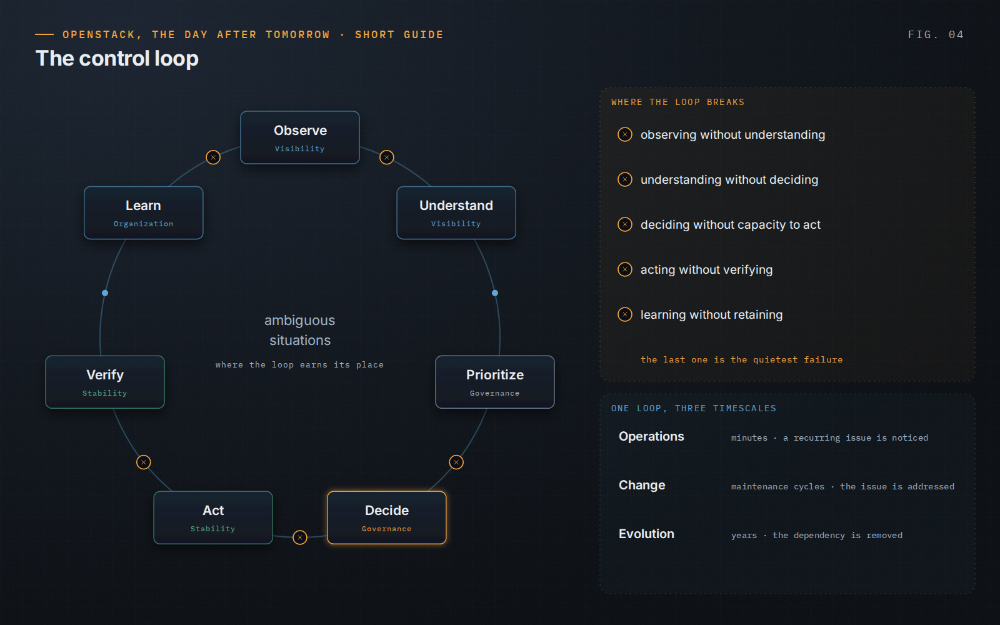

OpenStack, the Day After Tomorrow · Short Guide · page 04 of 18

# 04 · The operational mindset: understand before acting

*The control loop*

**The book connects the four capabilities through one loop. It is deliberately simple; its value comes from applying it consistently when the platform is under pressure.**

### Observe → Understand → Prioritize → Decide → Act → Verify → Learn

Visibility provides evidence, but evidence is not understanding. Understanding produces hypotheses and constraints. Prioritization brings in business impact. Decision rights determine who chooses. Action stays within understood boundaries. Verification checks the outcome, because technical success is not service success. Learning turns the result into organizational capability.

### Where the loop breaks

- observing without understanding;
- understanding without deciding;
- deciding without the capacity to act;
- acting without verifying;
- learning without retaining — the quietest failure.

### Proportional, not bureaucratic

A routine request goes from observation to action in minutes. The loop earns its place when the answer is not obvious, and it must work at human speed: lightweight for routine work, increasingly explicit as consequence and uncertainty grow.

> “If nothing changes after an incident, the organization should be able to explain why the existing controls were already sufficient.”
>
> — *OpenStack, the Day After Tomorrow*, Chapter 4

---

[← 03 · The enemy is loss of control](03-loss-of-control.md) &nbsp;·&nbsp; [Contents](../README.md#contents) &nbsp;·&nbsp; [05 · Read the signals before touching the platform →](05-read-the-signals.md)
