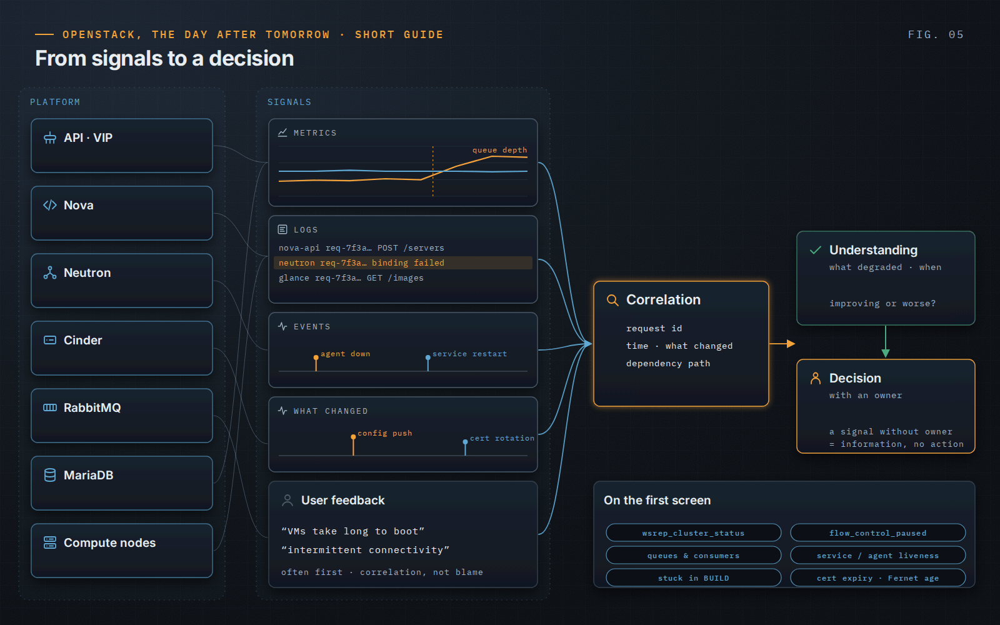

OpenStack, the Day After Tomorrow · Short Guide · page 05 of 18

# 05 · Read the signals before touching the platform

*Visibility before action*

**More data does not create visibility. Visibility starts with operational questions: what is affected, which dependencies are shared, what changed, and who owns it.**

### Symptoms are not state

A service can be running while unhealthy. RabbitMQ processes can be present while messaging is degraded; Nova processes can be active while scheduling or port binding blocks every request. The signals that matter describe the shared dependencies: Galera cluster status and flow control, queue depth and consumers, compute service and agent liveness, instances stuck in transitional states, certificate expiry dates and Fernet key age.

### Correlation beats volume

Every OpenStack API request carries a request identifier that the services propagate in their logs. A platform whose logs are searchable by that identifier can follow one failed boot across Nova, Placement, Neutron and Glance in minutes. The same applies to change context: deployments, configuration changes, maintenance and rotations belong in the same evidence chain as metrics.

### People are signals too

User reports and consumer feedback often reveal degradation before infrastructure metrics do. They enter the evidence chain for correlation, not for blame. And every critical signal needs an owner, or it is information without action.

> **Principle.** “The purpose of observability is to make the platform understandable enough to support the right decision at the right time.”
>
> — *OpenStack, the Day After Tomorrow*, Chapter 8

---

[← 04 · The operational mindset: understand before acting](04-the-operating-loop.md) &nbsp;·&nbsp; [Contents](../README.md#contents) &nbsp;·&nbsp; [06 · Investigate before changing →](06-investigate-before-changing.md)
