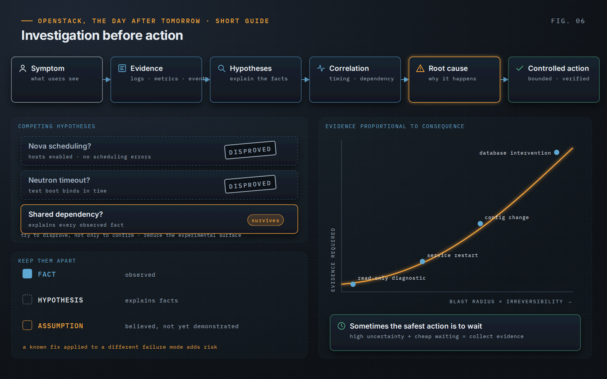

OpenStack, the Day After Tomorrow · Short Guide · page 06 of 18

# 06 · Investigate before changing

*Hypotheses, evidence, root cause*

**A failed VM creation says what the user experienced. It does not say which of the services and dependencies in the chain caused it.**

### Facts, hypotheses, assumptions

Operational reasoning separates what is observed, what explains it and what is merely believed. OpenStack produces plausible explanations in abundance: a scheduling problem looks like a Nova problem, a timeout looks like a Neutron problem. Good investigation tries to disprove hypotheses as well as confirm them, and reduces the experimental surface — one host, one workload pattern, one dependency observed without changing anything else.

### Evidence proportional to consequence

A read-only diagnostic needs little proof; a production database intervention needs much more. The burden of proof rises with blast radius and irreversibility. When uncertainty is high and waiting is cheap, collecting evidence is safer than changing the platform.

### A request is not a diagnosis

“Restart it”, “move these VMs”, “automate this” should each be translated back into the problem they are meant to solve before anyone acts. An incident resolved quickly but never understood tends to come back and consume the same capacity again.

> “Uncertainty is a risk signal in its own right.”
>
> — *OpenStack, the Day After Tomorrow*, Chapter 9

---

[← 05 · Read the signals before touching the platform](05-read-the-signals.md) &nbsp;·&nbsp; [Contents](../README.md#contents) &nbsp;·&nbsp; [07 · Understand the dependencies →](07-understand-dependencies.md)
