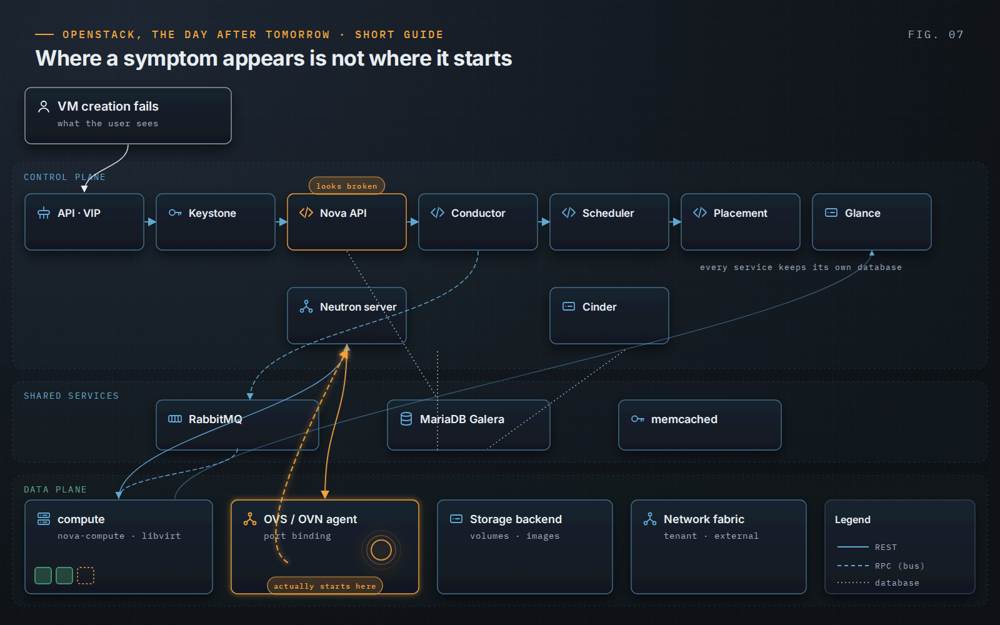

OpenStack, the Day After Tomorrow · Short Guide · page 07 of 18

# 07 · Understand the dependencies

*OpenStack is a distributed system*

**OpenStack is not one program but a set of cooperating services, each with its own database, configuration and failure modes, resting on a message bus, a database cluster, storage and networks that are not OpenStack at all.**

### What one VM creation traverses

Keystone authenticates. The Nova API records the request; the conductor coordinates; the scheduler asks Placement for capacity; the compute pulls the image from Glance and asks Neutron for a port, which the agent or OVN controller wires on the host. Nova waits for the `network-vif-plugged` event before finishing the boot. A failure anywhere in that chain looks, to the user, like “Nova is broken”.

### Control plane and data plane fail separately

If the APIs, the message bus or the databases stop, existing instances keep running, keep their storage and keep their traffic. What is lost is the ability to create, change or move resources. That separation is what makes “stop the APIs, protect the workloads” a real option in an incident rather than a euphemism for an outage.

### Assess capabilities, not components

An inventory lists what exists. The useful question is whether the organization can operate the resulting service: follow a real user journey through every dependency and ask, at each step, where the signal is, who owns it and how it is recovered. Gaps appear at team boundaries.

> “an instance that sits in BUILD until vif_plugging_timeout expires is usually a networking problem wearing a compute symptom.”
>
> — *OpenStack, the Day After Tomorrow*, Chapter 5

---

[← 06 · Investigate before changing](06-investigate-before-changing.md) &nbsp;·&nbsp; [Contents](../README.md#contents) &nbsp;·&nbsp; [08 · Stability before evolution →](08-stability-before-evolution.md)
