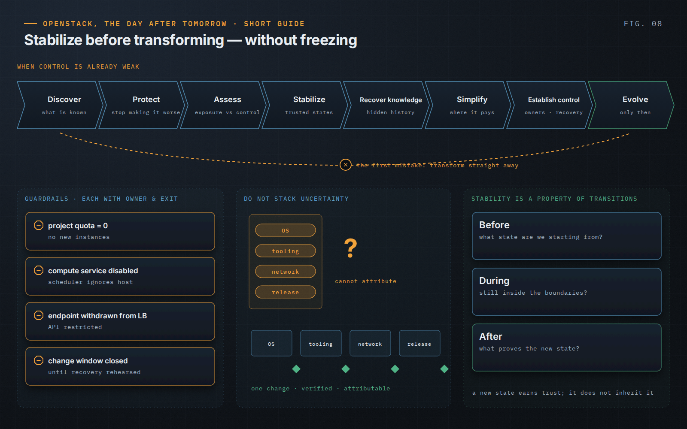

OpenStack, the Day After Tomorrow · Short Guide · page 08 of 18

# 08 · Stability before evolution

*Do not stack uncertainty*

**When a platform is already unstable, adding major change makes diagnosis harder and widens the blast radius of every problem. Stabilize first — but not forever.**

### Restore before you transform

When control is already weak, the first mistake is usually to start transforming. The book proposes a sequence that deliberately slows the urge to fix visible symptoms: Discover, Protect, Assess, Stabilize, Recover knowledge, Simplify, Establish control — and only then Evolve. Guardrails used on the way (a quota set to zero, a disabled compute service, an endpoint withdrawn from the load balancer) each need an owner and a removal condition.

### The caveat

Some platforms are so far behind — unmaintained releases, unpatched vulnerabilities — that the transformation is the only available stabilization. The rule is not “never move while things are difficult”. It is “do not stack uncertainty”: changing the OS, the deployment tooling, the network and the OpenStack release in one window makes any failure impossible to attribute.

### Stability lives in transitions

Before a change: what state are we starting from? During: how do we know we are still inside boundaries? After: what evidence tells us the new state can be trusted? A new state has to earn trust; it does not inherit it.

> “Stabilization that has no exit condition becomes the new architecture.”
>
> — *OpenStack, the Day After Tomorrow*, Chapter 7

---

[← 07 · Understand the dependencies](07-understand-dependencies.md) &nbsp;·&nbsp; [Contents](../README.md#contents) &nbsp;·&nbsp; [09 · Production is risk management →](09-production-is-risk-management.md)
