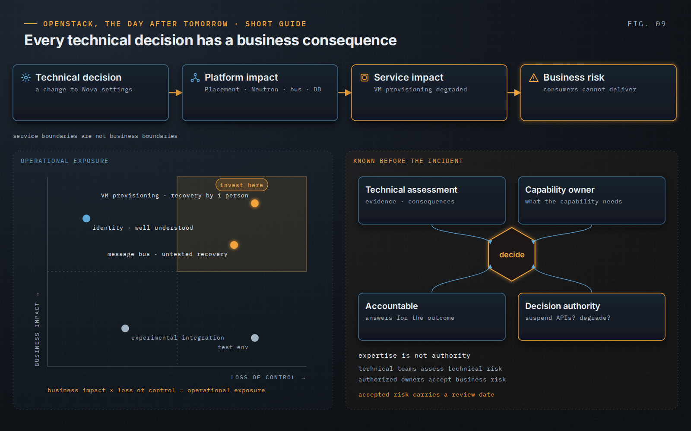

OpenStack, the Day After Tomorrow · Short Guide · page 09 of 18

# 09 · Production is risk management

*Every technical decision has a business consequence*

**A change that looks local to Nova may reach Placement, Neutron, the message bus, the databases, the hypervisors and the consumers’ own workflows. Service boundaries are not business boundaries.**

### From a command to a consequence

Technical decision → platform impact → service impact → business risk. Two virtual machines can look identical to the infrastructure and carry completely different business consequences, which is why criticality has to be translated into technical terms before the incident, not during it.

### Exposure, not complexity alone

The book offers a mental model rather than a formula: business impact multiplied by loss of control gives operational exposure. The highest priority is where a critical capability meets weak recovery, single-person knowledge or unexplained behaviour.

### Decision rights before the incident

Expertise is not authority. Before a consequential decision, four questions need answers: who assesses the technical risk, who owns the capability, who is accountable for the outcome, who decides. The organization should know in advance who can suspend the APIs, isolate a component or accept a temporary degradation. And accepted risk should carry a review date, because risk acceptance should expire.

> **Principle.** “Everyone can challenge. Someone must decide.”
>
> — *OpenStack, the Day After Tomorrow*, Chapter 13

---

[← 08 · Stability before evolution](08-stability-before-evolution.md) &nbsp;·&nbsp; [Contents](../README.md#contents) &nbsp;·&nbsp; [10 · Controlled change →](10-controlled-change.md)
