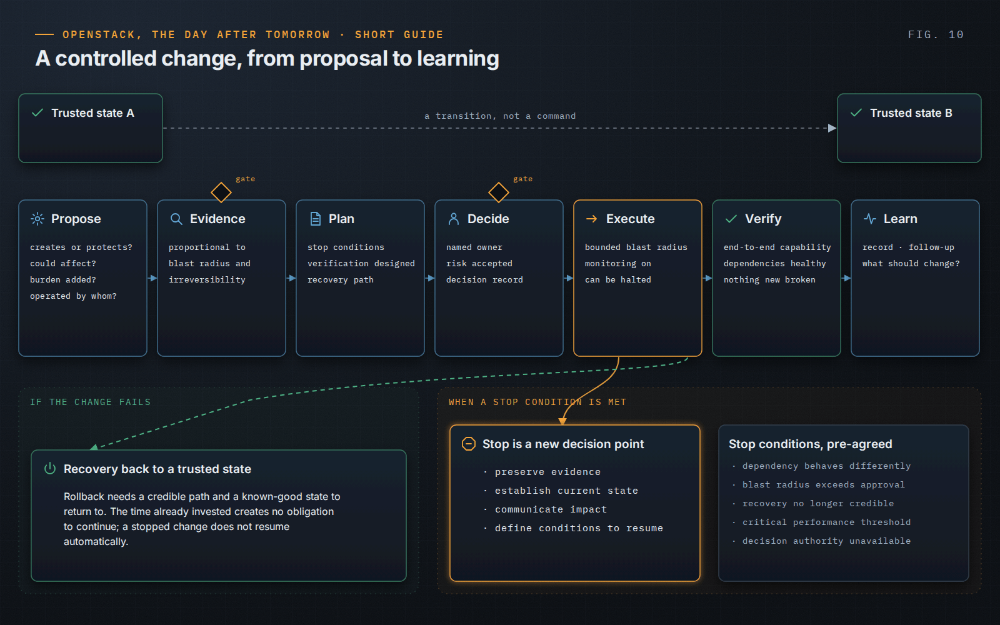

OpenStack, the Day After Tomorrow · Short Guide · page 10 of 18

# 10 · Controlled change

*Understood · recorded · verifiable · recoverable*

**Approval alone does not make a decision controlled. A controlled change knows what it risks, how failure will be detected and how the platform returns to a trusted state.**

### Before

Every proposal answers four questions: what capability it creates or protects, what existing capability it could affect, what operational burden it adds, and what it will take to operate once the delivery team has moved on. Verification and stop conditions are designed before execution, not improvised in the middle of it.

### During

Blast radius is bounded, monitoring is in place and the conditions to stop are concrete: a dependency behaves differently, the impact exceeds the approved boundary, recovery is no longer credible, the decision authority is unavailable. The time already invested creates no obligation to continue, and a stopped change does not resume automatically — resumption is a new decision.

### After

A change is complete when the capability it served is verified end to end, not when the command returns. A proportional decision record keeps the objective, evidence, uncertainty, options considered, rejected options, recovery path and follow-up, so that the next team does not mistake a deliberate choice for inertia.

> **Principle.** “Before changing a mission-critical OpenStack platform, understand enough to know what you are risking, how you will detect failure, and how you will recover if you are wrong.”
>
> — *OpenStack, the Day After Tomorrow*, Chapter 9

---

[← 09 · Production is risk management](09-production-is-risk-management.md) &nbsp;·&nbsp; [Contents](../README.md#contents) &nbsp;·&nbsp; [11 · Recovery is a feature →](11-recovery-is-a-feature.md)
