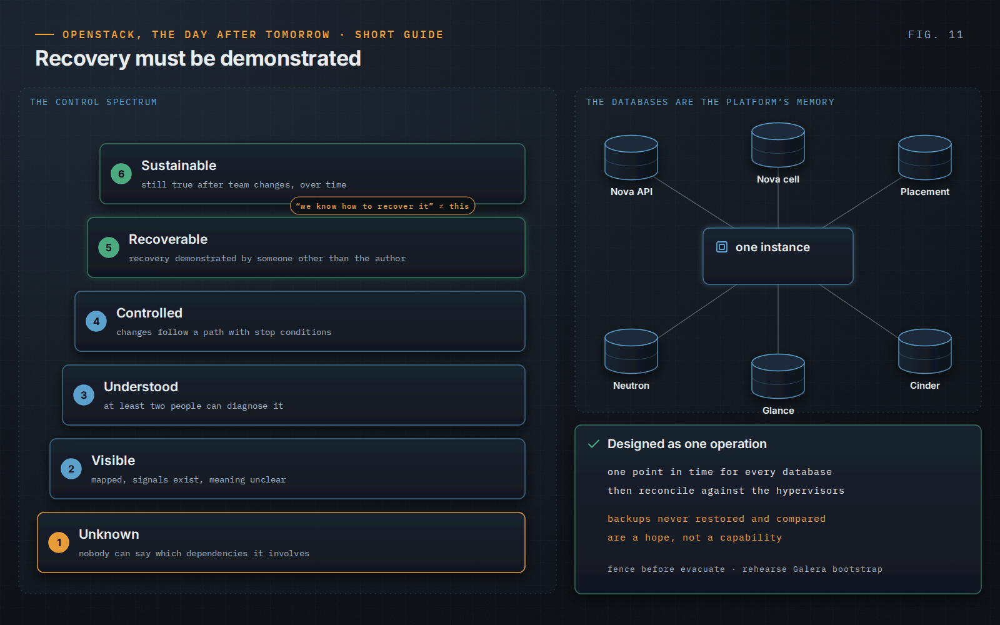

OpenStack, the Day After Tomorrow · Short Guide · page 11 of 18

# 11 · Recovery is a feature

*Availability is not recoverability*

**A service can run while the organization is unable to recover it under realistic failure conditions. Recovery starts from a trusted state, is designed around capabilities and must be demonstrated.**

### Demonstrated, not documented

“We know how to recover RabbitMQ” is not enough if the procedure lives in one memory. The book’s control spectrum makes the difference explicit: a capability is only *Recoverable* when recovery has been demonstrated by someone other than the author of the procedure, within a time the business accepts — and *Sustainable* when that still holds after team changes.

### The databases are the platform’s memory

The state of one instance is spread across Nova, Placement, Neutron, Cinder and Glance databases. Restoring them to different points in time produces a platform that disagrees with itself and with the hypervisors. Recovery is one operation, one point in time, followed by reconciliation against reality.

### Recovery is a change under pressure

The same disciplines apply, harder. A missing heartbeat does not prove a compute host is dead: fence it through out-of-band management before evacuating, or two copies of one server end up writing to the same volume. And sometimes the safest recovery of a disposable environment whose state nobody understands is a rebuild against a written baseline.

> **Principle.** “Recovery is a feature because a platform is not operational if the organization cannot demonstrate how it returns to a trusted state.”
>
> — *OpenStack, the Day After Tomorrow*, Chapter 10

---

[← 10 · Controlled change](10-controlled-change.md) &nbsp;·&nbsp; [Contents](../README.md#contents) &nbsp;·&nbsp; [12 · Technical debt: understood, controlled, decided →](12-technical-debt.md)
