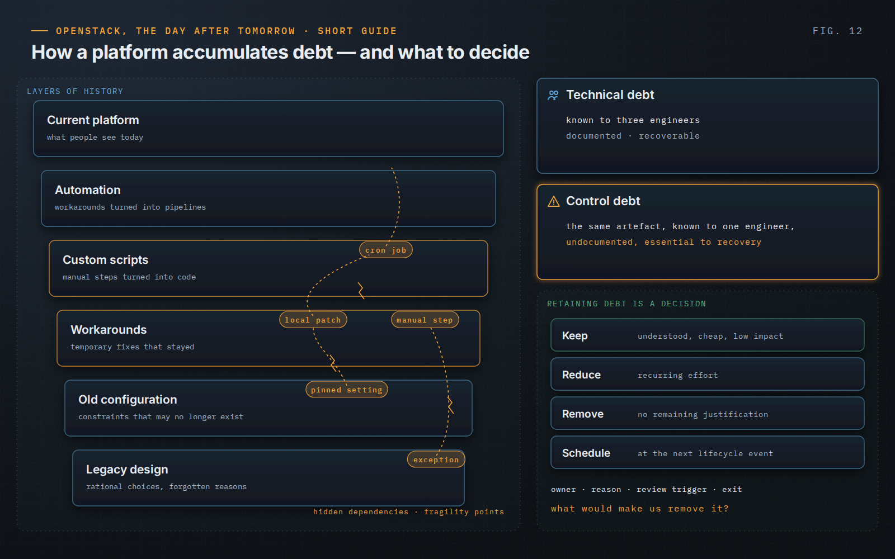

OpenStack, the Day After Tomorrow · Short Guide · page 12 of 18

# 12 · Technical debt: understood, controlled, decided

*Debt is not failure. Forgotten debt is.*

**Platforms rarely become hard to operate because someone designed them that way. Complexity accumulates through decisions that were each rational at the time.**

### Technical debt and control debt

A customization known to three engineers is technical debt. The same customization known to one engineer, undocumented and essential to recovery, is also control debt. The artefact is identical; the exposure is not. Complexity should also be priced in operator attention: every exception, special procedure and local patch is something a person must remember at three in the morning.

### Decide, do not just repay

Each item is kept, reduced, removed or scheduled for removal at a defined lifecycle event. Keeping a workaround can be entirely responsible — with a reason, an owner, a review trigger and an exit condition. The question that separates controlled debt from forgotten debt is simple: what would make us remove it?

### Workarounds and automation

The danger is not the workaround but the moment temporary becomes permanent: a manual step becomes a script, then deployment logic, and the reason disappears. Automation should follow understanding; automating an unresolved workaround makes the problem happen faster and at greater scale.

> **Principle.** “A workaround is safe only while the risk it introduces remains smaller than the risk it removes.”
>
> — *OpenStack, the Day After Tomorrow*, Chapter 15

---

[← 11 · Recovery is a feature](11-recovery-is-a-feature.md) &nbsp;·&nbsp; [Contents](../README.md#contents) &nbsp;·&nbsp; [13 · Security, upgrades and maintenance →](13-security-upgrades-maintenance.md)
