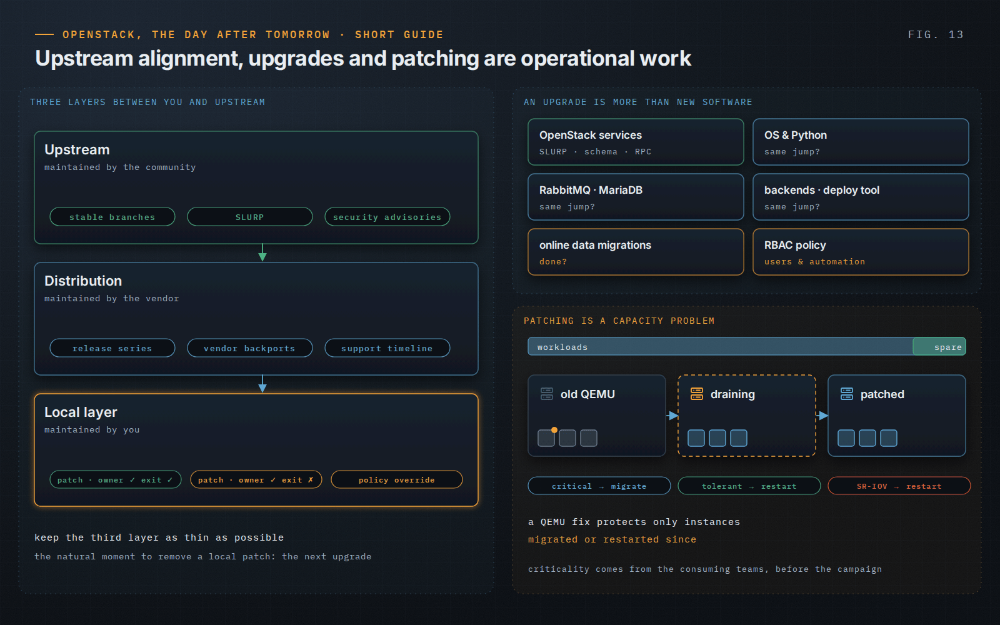

OpenStack, the Day After Tomorrow · Short Guide · page 13 of 18

# 13 · Security, upgrades and maintenance

*Staying close to upstream is operational control*

**A platform cannot stay unchanged indefinitely. Releases age, dependencies stop being maintained and the cost of standing still becomes part of the risk.**

### Know your three layers

Upstream, distribution, local. The vendor’s backports are maintained by the vendor; the layer that creates control debt is the local one on top. A backport can be the right decision — typically for a security advisory whose fix does not exist for the running series — but only with an owner, an origin, a test and an exit condition, usually the next upgrade.

### Upgrades are organizational readiness

SLURP lets the OpenStack services skip a release; the operating system, deployment tool, RabbitMQ, MariaDB and backends must support the same jump, and online data migrations must be complete. Readiness also means recovery coverage, capacity, ownership and policy: new default RBAC can change what users and automation are allowed to do.

### Security is platform work

Patching a hypervisor is a placement and capacity problem: a QEMU fix only protects instances migrated or restarted since, and spare capacity decides what can be live-migrated. Certificates and Fernet keys age silently and belong on the first screen and in rehearsed rotations.

> **Principle.** “Security requirements define what must be achieved. Platform capacity and business criticality determine how safely it can be achieved.”
>
> — *OpenStack, the Day After Tomorrow*, Chapter 20

---

[← 12 · Technical debt: understood, controlled, decided](12-technical-debt.md) &nbsp;·&nbsp; [Contents](../README.md#contents) &nbsp;·&nbsp; [14 · Operational memory and ownership →](14-operational-memory.md)
