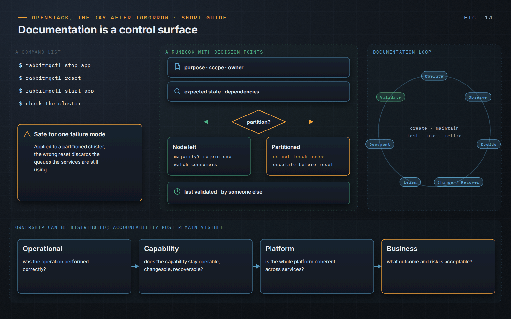

OpenStack, the Day After Tomorrow · Short Guide · page 14 of 18

# 14 · Operational memory and ownership

*The human system, part 1*

**Operating a critical platform does not rest on technology alone. Knowledge, ownership and accountability are part of the system — and they fail too.**

### Documentation preserves reasoning

A procedure that says “restart component X” is worth less than one that also says why, what state to expect, which dependencies matter, when to stop and what must never be done without escalation. The runbook for a RabbitMQ node that has left the cluster is not the runbook for a partitioned cluster, even though both start from the same alert. Decision records keep the *why*, including rejected options.

### Tested by someone else

A new engineer executing a real procedure alone, with a senior engineer watching but not helping, exposes every gap the team fills without noticing. Documentation that cannot be used by another engineer is not yet operational knowledge.

### Ownership and accountability

Ownership means maintaining a capability; accountability means answering for its outcome and risk. Ownership can be distributed; accountability must remain visible — at the operational, capability and platform levels, distinct from business accountability. Organizational boundaries must not become operational boundaries.

> “Every one of those gaps was knowledge the team had; none of it was on the page.”
>
> — *OpenStack, the Day After Tomorrow*, Chapter 11 — From the field

---

[← 13 · Security, upgrades and maintenance](13-security-upgrades-maintenance.md) &nbsp;·&nbsp; [Contents](../README.md#contents) &nbsp;·&nbsp; [15 · A team, not a collection of experts →](15-a-team-not-experts.md)
