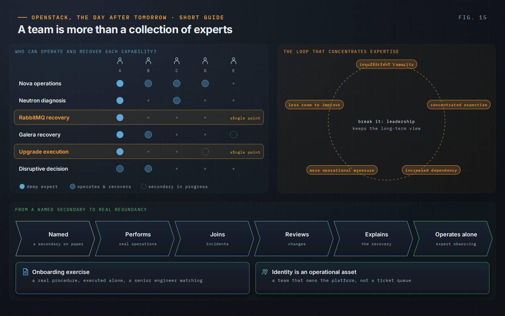

OpenStack, the Day After Tomorrow · Short Guide · page 15 of 18

# 15 · A team, not a collection of experts

*The human system, part 2*

**Strong experts create their own operational risk precisely because they are good. The purpose of expertise is to make the organization less dependent on it for routine work.**

### Redundancy of knowledge

Not two people on every task, but no critical capability with a single point of failure. One person may stay the deepest expert while several others can operate and recover. Naming a secondary is not enough: the secondary must perform real operations, join incidents, review changes and be able to explain the recovery.

### Identity, workload, leadership

A team with a shared purpose challenges unsafe changes and protects the platform beyond its tickets; a team that sees itself as a ticket queue has no reason to improve the system that generates them. Overload is a reliability risk: insufficient capacity concentrates expertise, which increases dependency and pressure, which leaves even less room for improvement. Leadership’s role is to keep the long-term view when short-term delivery pressure pushes against it.

### When people change

A departure can change the platform’s risk as much as an architecture change. It should trigger a control review — who can operate Nova, diagnose Neutron, recover the bus, run the next upgrade, take a disruptive decision — not just a redistribution of tasks. Experts, internal or external, should be challenged, and should leave the organization more capable than they found it.

> **Principle.** “A team is resilient when the platform remains operable after its experts change.”
>
> — *OpenStack, the Day After Tomorrow*, Chapter 12

---

[← 14 · Operational memory and ownership](14-operational-memory.md) &nbsp;·&nbsp; [Contents](../README.md#contents) &nbsp;·&nbsp; [16 · Decisions from the field →](16-decisions-from-the-field.md)
