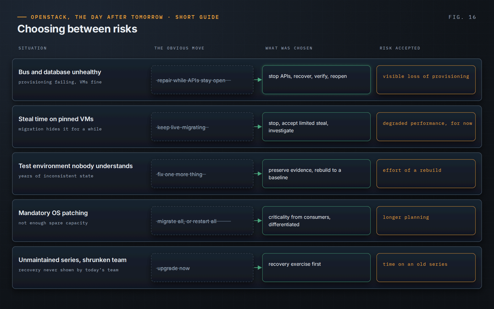

OpenStack, the Day After Tomorrow · Short Guide · page 16 of 18

# 16 · Decisions from the field

*Operating means choosing between risks*

**These are not recipes. They are situations from the book in which technical evidence, business impact and operational constraints collided, and in which the safe choice was not the obvious one.**

### Stop, to keep control

RabbitMQ and the Galera cluster were unhealthy; VM creation was failing, running workloads were not. The team stopped the APIs, restarted the bus after purging its queues, then MariaDB, verified end to end and only then reopened. A visible, bounded loss of provisioning instead of an unstable control plane accepting requests.

### Investigate instead of repeating

Pinned instances showed steal time; live migration made it disappear, until it came back. The team stopped migrating the same workloads, accepted limited steal, and investigated the cause instead of relocating the symptom.

### Rebuild what nobody understands

A shared test environment had accumulated years of inconsistent state. Evidence was preserved, the intended baseline written down, and the environment rebuilt and validated against it. Production changes that equation entirely.

### Patch within real capacity

There was not enough spare capacity to live-migrate everything before OS patching. Consuming teams supplied criticality and acceptable downtime; critical workloads were migrated, others restarted in coordination.

### Rehearse before upgrading

In the book’s decision model, an unmaintained platform’s upgrade ranking hinged on one fact: nobody still on the team had demonstrated recovery. The first action was a recovery exercise, not an upgrade.

> **Principle.** “Stopping is not giving up control. In the right circumstances, it is how control is preserved.”
>
> — *OpenStack, the Day After Tomorrow*, Chapter 19

---

[← 15 · A team, not a collection of experts](15-a-team-not-experts.md) &nbsp;·&nbsp; [Contents](../README.md#contents) &nbsp;·&nbsp; [17 · The operating principles →](17-operating-principles.md)
