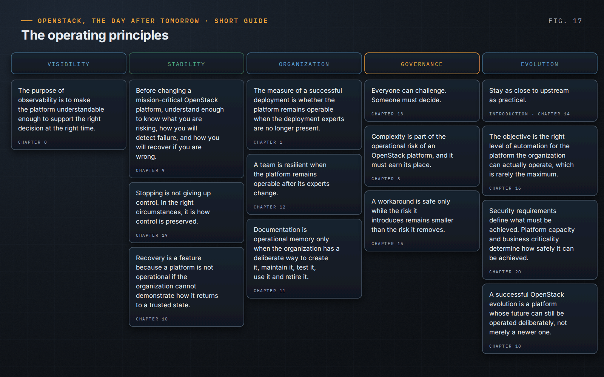

OpenStack, the Day After Tomorrow · Short Guide · page 17 of 18

# 17 · The operating principles

*The philosophy in one page*

**The book states its operating rules as principles. They are recommendations, not laws of nature; a different platform and organization may weigh them differently. Together they describe one way of thinking about production.**

### Visibility

> **The purpose of observability is to make the platform understandable enough to support the right decision at the right time.** 
> Chapter 8

### Stability

> **Before changing a mission-critical OpenStack platform, understand enough to know what you are risking, how you will detect failure, and how you will recover if you are wrong.** 
> Chapter 9

> **Stopping is not giving up control. In the right circumstances, it is how control is preserved.** 
> Chapter 19

> **Recovery is a feature because a platform is not operational if the organization cannot demonstrate how it returns to a trusted state.** 
> Chapter 10

### Organization

> **The measure of a successful deployment is whether the platform remains operable when the deployment experts are no longer present.** 
> Chapter 1

> **A team is resilient when the platform remains operable after its experts change.** 
> Chapter 12

> **Documentation is operational memory only when the organization has a deliberate way to create it, maintain it, test it, use it and retire it.** 
> Chapter 11

### Governance

> **Everyone can challenge. Someone must decide.** 
> Chapter 13

> **Complexity is part of the operational risk of an OpenStack platform, and it must earn its place.** 
> Chapter 3

> **A workaround is safe only while the risk it introduces remains smaller than the risk it removes.** 
> Chapter 15

### Evolution

> **Stay as close to upstream as practical.** 
> Introduction · Chapter 14

> **The objective is the right level of automation for the platform the organization can actually operate, which is rarely the maximum.** 
> Chapter 16

> **Security requirements define what must be achieved. Platform capacity and business criticality determine how safely it can be achieved.** 
> Chapter 20

> **A successful OpenStack evolution is a platform whose future can still be operated deliberately, not merely a newer one.** 
> Chapter 18

---

[← 16 · Decisions from the field](16-decisions-from-the-field.md) &nbsp;·&nbsp; [Contents](../README.md#contents) &nbsp;·&nbsp; [18 · From deployment to operation →](18-from-deployment-to-operation.md)
