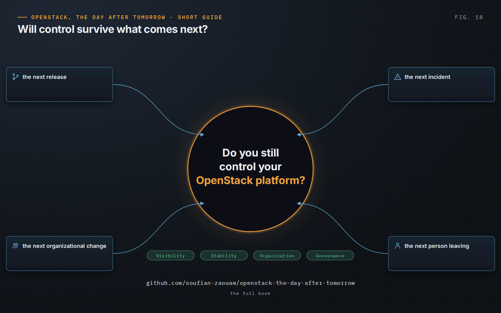

OpenStack, the Day After Tomorrow · Short Guide · page 18 of 18

# 18 · From deployment to operation

*The day after tomorrow*

**Deployment creates an OpenStack platform. Day 2 creates the organization’s relationship with it — and that relationship decides whether the platform can still be patched, recovered, upgraded, simplified and challenged.**

### The questions that carry the discipline

- What do we know? What remains uncertain?
- What does the business depend on? What are we protecting?
- What could this action break? Can we recover?
- Who decides? What are we accepting by choosing this option?
- What will we learn from the outcome?

### The ability to say no

To a change whose risk is not understood, to unnecessary complexity, to automation without sufficient value, to a workaround that has become dangerous, to a transformation the organization cannot yet control — and sometimes to the pressure to restore everything immediately when protecting the existing platform is the safer choice.

### Go further

This guide gives the ideas. The full book develops them: the assessment worksheet and control spectrum, the measures the platform can produce itself, the technical notes on Nova, Neutron, RabbitMQ, Galera, SLURP and live migration, the decision framework with its gates and weighted model, and the two field cases worked through in full.

**Read the full book:** [https://github.com/soufian-zaouam/openstack-the-day-after-tomorrow](https://github.com/soufian-zaouam/openstack-the-day-after-tomorrow)

> “OpenStack does not end at deployment. It begins there. The platform will change, people will change, the organization will change. The measure of operational maturity is whether control survives those changes.”
>
> — *OpenStack, the Day After Tomorrow*, Conclusion

---

[← 17 · The operating principles](17-operating-principles.md) &nbsp;·&nbsp; [Contents](../README.md#contents) &nbsp;·&nbsp; [The full book →](https://github.com/soufian-zaouam/openstack-the-day-after-tomorrow)
